create a proper working flow in the mermaid.js with this information for taxwala.ai

how auth screen should look like 

get inspire from the miro.com

simple onboarding with pop up where in the background they show the potetial screen what they could achieve and they will ones they will signup

first ask their email address and then the password and submit if the email exist match the password if correct let them in else throw error

if password does not exist then create the account and send email verification

and continue with onboarding question

auth 
    - with email and password

ask few onboarding questions
    phone number
    like where they are coming from?
    what are they individual / company
    simple record their voice or create input text what are suppose to achive here.
    many mor questions to fully understand them in the meanwhile
    track their ip to know the location
    also ask are they technical or non tech-technical
    professional
    linkedin or instagram accound

- if they are individual continue to dashboard and wait for email to be verified and allow email to be change to unique email if they are willing and say please verify your email address first or if incorrect change it because we will send important notifications on the email

- if they are company say launching soon

```mermaid
flowchart TD

    %% TaxWala.ai Auth + Onboarding Flow (Miro-style UX)

    Start["User Visits TaxWala.ai"] --> Landing["Auth Screen (Popup Modal)\nBackground Preview: Dashboard + AI Tax Insights"]

    %% Step 1: Email Entry
    Landing --> EmailStep["Enter Email Address"]
    EmailStep --> PasswordStep["Enter Password"]

    %% Step 2: Check Account
    PasswordStep --> CheckAccount{"Does Email Exist?"}

    %% Existing User Login
    CheckAccount -->|Yes| LoginCheck{"Password Correct?"}
    LoginCheck -->|Yes| SuccessLogin["Login Success → Continue"]
    LoginCheck -->|No| ErrorLogin["Error: Incorrect Password\nTry Again"]

    %% New User Signup
    CheckAccount -->|No| CreateAccount["Create New Account"]
    CreateAccount --> SendVerify["Send Email Verification Link"]

    %% Step 3: Onboarding Questions
    SuccessLogin --> Onboarding
    SendVerify --> Onboarding

    subgraph Onboarding["Onboarding Questions (Quick Setup)"]
        direction TB
        Q1["Phone Number"]
        Q2["Where are you coming from?\n(City/Country auto-detect via IP)"]
        Q3["User Type?\nIndividual / Company"]
        Q4["Technical or Non-Technical?"]
        Q5["Professional Background"]
        Q6["LinkedIn / Instagram (Optional)"]
        Q7["Goal Input\n(Text or Voice Note)\nWhat do you want to achieve with TaxWala?"]

        Q1 --> Q2 --> Q3 --> Q4 --> Q5 --> Q6 --> Q7
    end

    %% Step 4: Routing Based on User Type
    Q7 --> UserTypeDecision{"User Type Selected?"}

    %% Individual Flow
    UserTypeDecision -->|Individual| IndividualDash["Go to Dashboard"]

    IndividualDash --> EmailStatus{"Email Verified?"}

    EmailStatus -->|Yes| FullAccess["Full Access Enabled"]
    EmailStatus -->|No| VerifyReminder["Show Banner:\nPlease Verify Email\nor Change Email (Unique)"]

    VerifyReminder --> FullAccess

    %% Company Flow
    UserTypeDecision -->|Company| CompanyWait["Company Accounts\nLaunching Soon Screen"]

    %% End States
    FullAccess --> End["User Starts Step 1: Add Tax Details"]
    CompanyWait --> EndCompany["Notify when Company Filing Launches"]
```

