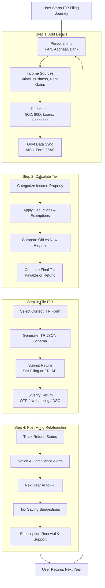

Roadmap for the full user journey. Use this as the backbone for specs, API contracts, and UX flows in Steps 1–4.

- Audience: product + eng + design.
- Promise: single source of truth for the tax-filing journey; each step links to a deeper doc in this folder.
- Inputs: user intent to file; authenticated session; FY context.
- Outputs: filed and verified ITR, stored artefacts, and a retained customer for next year.

Key rules to keep in mind while building:
- Every transition must have a clear data contract (what payload moves from one step to the next).
- Government sync (AIS/26AS) is the trust anchor; keep it visible in Step 1 and re-check in Step 2.
- E-verification is mandatory; do not let the flow end before it.
- Step 4 is not optional—surface it immediately after filing to drive retention.

