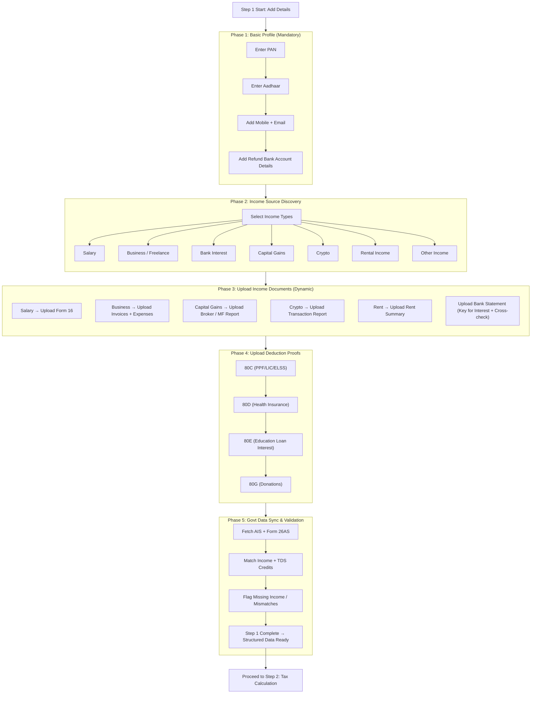

Step 1 is the foundation. If we capture the right inputs cleanly, Steps 2–4 stay automated and low-friction.

What this doc covers
- Purpose: build a document-collection and validation engine that converts raw uploads into structured data.
- Audience: product, backend, frontend, and QA.
- Outcome: validated user profile + income + deductions + tax credits ready for Step 2.

Success criteria
- Mandatory profile fields are captured and verified (PAN, Aadhaar linkage, contact, refund bank).
- Income types drive a dynamic, minimal doc checklist (no “upload everything”).
- AIS/26AS sync runs before the user leaves Step 1; mismatches are surfaced.
- Output is a normalized payload ready for the tax engine.

Phase breakdown
1) Basic profile (required for all)
- PAN (text, format validation; optional card upload).
- Aadhaar (masked entry; ensure linkage flag).
- Contact: mobile + email for OTP/login/notices.
- Refund bank: account number, IFSC, bank name; optional cancelled cheque; mark prevalidation status.

2) Income source discovery (drives checklist)
- Ask: “What type of income did you have this year?”
- Options: Salary; Business/Freelance; Bank Interest; Stocks/Mutual Funds; Crypto/VDA; Rental; Pension; Foreign; Other.
- Persist selections; they decide which doc widgets render.

3) Document requirements by income type (dynamic rendering)
- Salary: Form 16 (mandatory); salary slips (optional backup); HRA proofs if claimed (rent receipts + landlord PAN when rent > 1L).
- Bank interest: bank statement or interest certificate; Form 16A if TDS deducted.
- Business/Freelance: invoices/payment proofs; expense proofs (rent, tools, travel, internet); optional GST returns; system-generated P&L summary if available.
- Capital gains (equity/MF): broker capital gains statement; Mutual Fund CAS.
- Crypto/VDA: full transaction report (flat 30% rule).
- Rental: rent received summary; optional rent agreement; home-loan interest certificate if applicable.
- Other: dividends, pension certificate, lottery/other proofs.

4) Deduction document collection
- Ask: “Did you invest in tax-saving instruments?”
- Collect proofs for 80C (LIC/PPF/ELSS/tuition), 80D (health insurance premiums), 80E (education loan interest), 80G (donations), 80CCD (NPS contributions).

5) Government data sync (trust anchor)
- Fetch AIS + Form 26AS after uploads.
- Show status chips: Matched, Missing income found, TDS credit missing.
- Highlight gaps before allowing progress.

6) Validation gate before Step 2
- PAN verified; Form 16 present when Salary is selected.
- AIS synced at least once; required deduction proofs present for claimed sections.
- Refund bank validated or marked pending; upload set is complete per income selection.

Step 1 output (data contract to Step 2)
- Profile: PAN, Aadhaar, address, contact, bank info with validation flags.
- Income summary: salary, interest, gains, business, rental, other (numbers + source docs).
- Deductions: amounts per section with proof references.
- Tax credits: TDS/TCS/advance-tax derived from 26AS.

UX copy guidance
- Avoid “Upload everything.” Prefer “Connect your tax data” and “We’ll auto-detect missing income.”
- Keep checklist short and context-specific; pre-fill wherever possible.

MVP scope (TaxWala.ai launch)
- Must: PAN, Form 16 upload, AIS sync, bank interest, 80C + 80D proofs.
- Nice later: business/GST flows, crypto, full notice handling for mismatches.

# Flow diagram

