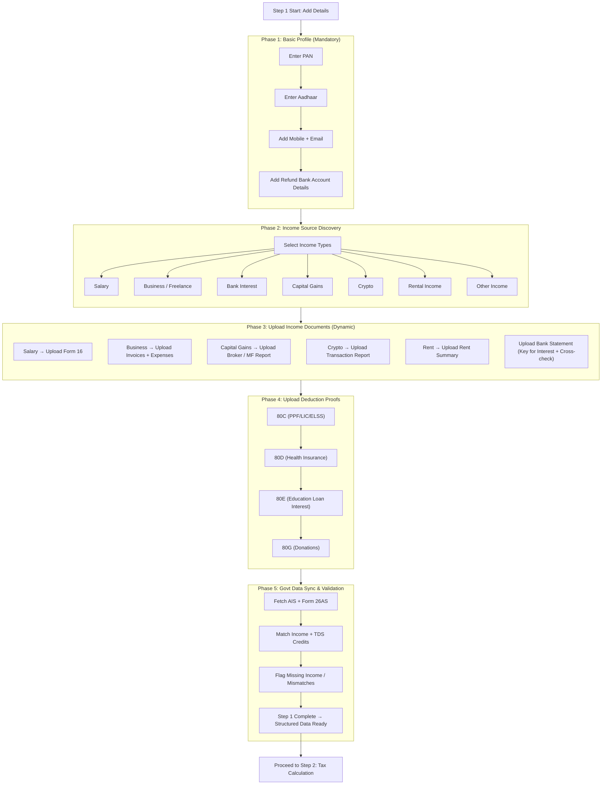

Perfect. Step 1 is the foundation of your entire SaaS.

If Step 1 is designed well:
	•	calculation becomes automatic
	•	filing becomes error-free
	•	users trust you
	•	retention improves

So let’s go deep.

⸻

Step 1: Add Details (Document Collection Engine)

Think of Step 1 as:

User onboarding + income discovery + document gathering + govt cross-check

Your SaaS should NOT ask for “upload everything”.

Instead:

Ask questions → Identify income types → Show only required docs.

⸻

Step 1 Breakdown (Best SaaS Structure)

Phase 1: Basic Profile (Required for Everyone)

Collect these first (mandatory)

1. PAN

Why:
	•	PAN is the taxpayer ID
	•	Needed for AIS, Form 26AS, filing

Input:
	•	PAN number (text)
Optional:
	•	PAN card upload

⸻

2. Aadhaar

Why:
	•	Required for e-verification
	•	Linking is mandatory

Input:
	•	Aadhaar number (masked)
No need for full upload usually

⸻

3. Contact Details

Why:
	•	OTP login + notices + updates
	•	Mobile number
	•	Email

⸻

4. Bank Account (Refund)

Why:
	•	Refund goes here
	•	Prevalidation required

Inputs:
	•	Account number
	•	IFSC
	•	Bank name

Document:
	•	Cancelled cheque (optional)

⸻

Phase 2: Income Source Discovery (Smart Questionnaire)

Before documents, ask:

“What type of income did you have this year?”

Checkboxes:
	•	Salary (job)
	•	Freelancing / Business
	•	Bank Interest
	•	Stocks / Mutual Funds
	•	Crypto
	•	Rental Income
	•	Pension
	•	Foreign Income
	•	Other income

This decides the entire doc checklist.

⸻

Phase 3: Document Requirements by Income Type

Now show document requests dynamically.

⸻

A. Salary Income (Most Common)

Required Documents

1. Form 16 (mandatory)
Why:
	•	Salary breakup
	•	Employer TDS proof

Data extracted:
	•	Gross salary
	•	Exemptions
	•	Standard deduction
	•	TDS paid

Upload:
PDF

⸻

2. Salary Slips (optional)
Why:
	•	Backup if Form 16 incorrect
	•	Helps validate allowances

⸻

3. HRA Proof (only if claimed)
Documents:
	•	Rent receipts
	•	Landlord PAN (if rent > ₹1L/year)

Why:
	•	Needed to support exemption

⸻

B. Bank Interest Income

Required

1. Bank Statement OR Interest Certificate
Why:
	•	Savings interest not fully shown in Form 16

Extract:
	•	Savings interest
	•	FD interest

⸻

2. Form 16A (if TDS deducted)
Why:
	•	Bank deducted tax, must claim credit

⸻

C. Business / Freelancing

Required

1. Revenue Proof
	•	Invoices
	•	Payment receipts

Why:
	•	Establish turnover

⸻

2. Expense Proof (if actual taxation)
	•	Rent
	•	Software tools
	•	Travel
	•	Internet

Why:
	•	Reduce taxable profit

⸻

3. P&L Summary (system-generated ideally)

⸻

4. GST Returns (if registered)
Why:
	•	Govt matches turnover

⸻

D. Capital Gains (Stocks, Mutual Funds)

Required

1. Broker Capital Gains Statement
Why:
	•	STCG vs LTCG rules differ

Extract:
	•	Sale value
	•	Purchase value
	•	Gains

⸻

2. Mutual Fund CAS
Why:
	•	Consolidated investment record

⸻

E. Crypto / VDA Income

Required

Transaction Report
Why:
	•	Flat 30% tax + mandatory reporting

⸻

F. Rental Income

Required

Rent Received Summary
Why:
	•	Income under House Property

Optional:
	•	Rent agreement

⸻

Home Loan Interest Certificate (if property financed)
Why:
	•	Deduction under Section 24

⸻

G. Other Income
	•	Dividend statements
	•	Pension certificate
	•	Lottery winnings proof

⸻

Phase 4: Deduction Document Collection

After income docs, ask:

“Did you invest in tax saving instruments?”

⸻

Common Deduction Docs

80C (up to ₹1.5L)
	•	LIC receipts
	•	PPF proof
	•	ELSS statement
	•	Tuition fees receipt

⸻

80D (Health Insurance)
	•	Premium receipts

⸻

80E (Education Loan)
	•	Interest certificate

⸻

80G (Donations)
	•	Donation receipts

⸻

NPS (80CCD)
	•	Contribution statement

⸻

Phase 5: Government Data Sync (Most Important SaaS Feature)

Once docs are uploaded, connect:

AIS + Form 26AS

Why:
	•	Govt already has salary, interest, trades
	•	Prevent mismatch notices

Your SaaS should show:
	•	“Matched”
	•	“Missing income found”
	•	“TDS credit missing”

This is the trust-builder.

⸻

Phase 6: Validation Rules (Step 1 Output)

Before moving to Step 2, system must ensure:
	•	PAN verified
	•	Form 16 uploaded (if salary)
	•	AIS matched
	•	Required deductions supported
	•	Bank account validated

⸻

Step 1 Output (Clean Structured Data)

By end of Step 1, you should have:

User Profile
	•	PAN, Aadhaar, Address

Income Summary
	•	Salary: X
	•	Interest: Y
	•	Gains: Z

Deductions
	•	80C: A
	•	80D: B

Tax Credits
	•	TDS: C

This becomes input for Step 2 Calculation.

⸻

Product Design Suggestion (Best UX)

Do NOT call it “Upload Documents”

Call it:
	•	“Connect your tax data”
	•	“Upload Form 16”
	•	“We’ll auto-detect missing income”

Keep it simple.

⸻

MVP Document Collection (TaxWala.ai Launch)

Start with only:

✅ PAN
✅ Form 16
✅ AIS Sync
✅ Bank Interest
✅ 80C + 80D

This covers 80% of salaried India.

# Flow diagram

