# Details

Perfect. Step 2 is the “brain” of your SaaS.

Step 1 collects documents.
Step 2 converts them into:
	•	taxable income
	•	tax liability
	•	refund/payable
	•	regime recommendation
	•	ready-to-file numbers

Let’s break Step 2 into clear phases (like a tax calculation pipeline).

⸻

Step 2: Calculate Tax (Multi-Phase Plan)

Think of Step 2 as:

Structured Data → Tax Engine → Final Payable/Refund

⸻

Phase 1: Normalize & Validate Input Data

What happens first?

Before calculation, clean everything.

Inputs from Step 1:
	•	Salary numbers (Form 16)
	•	Interest (bank statement)
	•	Gains (broker report)
	•	Deductions (80C proofs)
	•	AIS + 26AS data

Actions:
	•	Convert all values into standard fields
	•	Remove duplicates (same income from multiple docs)
	•	Validate missing required items

Output:
Clean income + deduction dataset

⸻

Phase 2: Income Categorization (IT Act Buckets)

Now classify income under the 5 legal heads:
	1.	Income from Salary
	2.	Income from House Property
	3.	Profits from Business/Profession
	4.	Capital Gains
	5.	Income from Other Sources

Why this comes early:
ITR forms + tax rules depend on correct head.

Output:
Income grouped properly

⸻

Phase 3: Compute Gross Total Income (GTI)

Now sum up:

Salary Income
	•	House Property Income
	•	Business Income
	•	Capital Gains
	•	Other Income
= Gross Total Income

This is the starting point for taxation.

Output:
Gross Total Income

⸻

Phase 4: Apply Exemptions (Before Deductions)

Some income parts are exempt before deductions:

Examples:
	•	HRA exemption
	•	LTA exemption
	•	Agricultural income (partial)
	•	Allowances under Form 16

So calculation order is:

Income → Exemptions → Net Income

Output:
Net Income after exemptions

⸻

Phase 5: Apply Standard Deduction & Salary Adjustments

For salaried users:
	•	Standard deduction ₹50,000
	•	Professional tax (if applicable)

This is automatic.

Output:
Adjusted salary income

⸻

Phase 6: Deduction Engine (Chapter VI-A)

Now apply deductions:
	•	80C (₹1.5L cap)
	•	80D (health insurance)
	•	80E (education loan)
	•	80G (donations)
	•	80CCD (NPS extra)

Rule engine checks:
	•	Eligibility
	•	Limits
	•	Proof uploaded

Output:
Total deductions applied

⸻

Phase 7: Taxable Income Calculation

Now compute:

Taxable Income = Net Income – Deductions

Round off as per rules.

Output:
Final taxable income

⸻

Phase 8: Regime Comparison (Old vs New)

Your SaaS should always compute both:

Old Regime
	•	Allows deductions
	•	Higher slabs

New Regime
	•	Lower slabs
	•	No major deductions

System compares:

Tax under Old
vs
Tax under New

Then recommends:

“Save ₹X by choosing New Regime”

Output:
Best regime suggestion

⸻

Phase 9: Slab Tax Computation

Now apply slab rates:
	•	0% up to threshold
	•	Progressive slabs
	•	Special rates for:
	•	LTCG
	•	STCG
	•	Crypto (30%)

Output:
Base tax amount

⸻

Phase 10: Add Surcharge + Cess

Add:
	•	Surcharge (high income cases)
	•	Health & Education cess (4%)

Output:
Total tax liability

⸻

Phase 11: Subtract Taxes Already Paid (Credits)

Now adjust:
	•	TDS (salary + bank)
	•	Advance tax paid
	•	Self assessment tax
	•	TCS credits

From Form 26AS

Output:
Net tax payable or refund

⸻

Phase 12: Refund or Payment Decision

Final result:

If tax paid > liability → Refund
If liability > tax paid → Pay remaining tax

System generates:
	•	Refund estimate
OR
	•	Challan amount to pay

Output:
Final payable/refund

⸻

Phase 13: Compliance & Error Checks

Before Step 3 filing:
	•	AIS mismatch unresolved?
	•	Missing TDS credit?
	•	Wrong regime selected?
	•	Deduction proofs missing?

Show warnings:

“Interest income in AIS not included”

Output:
Return ready for filing

⸻

Step 2 Final Output (For Step 3)

At the end, SaaS produces:
	•	Selected regime
	•	Total income
	•	Total deductions
	•	Taxable income
	•	Tax liability
	•	TDS credits
	•	Refund/payable
	•	ITR-ready structured JSON fields

⸻

Step 2 Pipeline Summary
	1.	Clean data
	2.	Categorize income
	3.	Compute GTI
	4.	Apply exemptions
	5.	Apply salary deductions
	6.	Apply 80C/80D/etc
	7.	Compute taxable income
	8.	Compare regimes
	9.	Slab tax calculation
	10.	Add cess/surcharge
	11.	Adjust TDS credits
	12.	Refund/payable result
	13.	Compliance validation

⸻

MVP Version (Salaried First)

For TaxWala.ai MVP, Step 2 can be:
	•	Salary from Form 16
	•	Interest from AIS
	•	80C + 80D
	•	Old vs New comparison
	•	Refund/payable output

That covers 80% users.

⸻

If you want, I can now create:
	1.	Mermaid flow diagram for Step 2
	2.	Database calculation fields schema
	3.	Rule engine pseudocode
	4.	Exact tax slab + regime tables for FY 2025-26

Just say “draw step 2 mermaid” or “give schema”.

# Flow diagram

```mermaid
flowchart TD

    Start["Step 2 Start: Tax Calculation"]

    %% Phase 1: Normalize & Validate Data
    subgraph P1["Phase 1: Normalize & Validate Inputs"]
        direction TB
        A1["Load Structured Data from Step 1"]
        A2["Clean & Standardize Values"]
        A3["Validate Missing or Duplicate Entries"]
        A1 --> A2 --> A3
    end

    %% Phase 2: Income Categorization
    subgraph P2["Phase 2: Categorize Income Heads"]
        direction TB
        B1["Salary Income"]
        B2["House Property Income"]
        B3["Business / Profession Income"]
        B4["Capital Gains Income"]
        B5["Other Sources Income"]
    end

    %% Phase 3: Compute Gross Total Income
    subgraph P3["Phase 3: Compute Gross Total Income"]
        direction TB
        C1["Sum All Income Heads"]
        C2["Gross Total Income (GTI) Generated"]
        C1 --> C2
    end

    %% Phase 4: Apply Exemptions
    subgraph P4["Phase 4: Apply Exemptions"]
        direction TB
        D1["HRA / LTA / Allowance Exemptions"]
        D2["Exempt Income Adjustments"]
        D1 --> D2
    end

    %% Phase 5: Salary Adjustments
    subgraph P5["Phase 5: Standard Deduction & Salary Adjustments"]
        direction TB
        E1["Apply Standard Deduction (₹50,000)"]
        E2["Adjust Net Salary Income"]
        E1 --> E2
    end

    %% Phase 6: Deduction Engine
    subgraph P6["Phase 6: Apply Chapter VI-A Deductions"]
        direction TB
        F1["80C Investments"]
        F2["80D Health Insurance"]
        F3["80E Education Loan Interest"]
        F4["80G Donations"]
        F5["NPS (80CCD)"]
        F6["Total Deductions Computed"]
        F1 --> F2 --> F3 --> F4 --> F5 --> F6
    end

    %% Phase 7: Taxable Income
    subgraph P7["Phase 7: Compute Taxable Income"]
        direction TB
        G1["Taxable Income = Net Income - Deductions"]
        G2["Final Taxable Income Ready"]
        G1 --> G2
    end

    %% Phase 8: Regime Comparison
    subgraph P8["Phase 8: Tax Regime Comparison (Decision Point)"]
        direction TB
        H1["Compute Tax Under Old Regime"]
        H2["Compute Tax Under New Regime"]
        H3["Recommend Best Regime"]
        H4["User Confirms or Overrides"]
        H1 --> H2 --> H3 --> H4
    end

    %% Phase 9: Slab Tax Computation
    subgraph P9["Phase 9: Slab & Special Rate Tax Calculation"]
        direction TB
        I1["Apply Slab Rates (Selected Regime)"]
        I2["Apply Special Rates (LTCG/STCG/Crypto)"]
        I3["Base Tax Computed"]
        I1 --> I2 --> I3
    end

    %% Phase 10: Cess & Surcharge
    subgraph P10["Phase 10: Add Cess & Surcharge"]
        direction TB
        J1["Add Surcharge (if applicable)"]
        J2["Add Health & Education Cess (4%)"]
        J3["Total Tax Liability Generated"]
        J1 --> J2 --> J3
    end

    %% Phase 11: Tax Credits Adjustment
    subgraph P11["Phase 11: Adjust Taxes Already Paid"]
        direction TB
        K1["Subtract TDS (Form 26AS)"]
        K2["Subtract Advance/Self Assessment Tax"]
        K3["Net Tax Payable or Refund"]
        K1 --> K2 --> K3
    end

    %% Phase 12: Final Review & Output
    subgraph P12["Phase 12: Compliance Checks & Output"]
        direction TB
        L1["AIS Mismatch & Error Validation"]
        L2["Return Ready for Filing"]
        L3["Proceed to Step 3: File ITR"]
        L1 --> L2 --> L3
    end

    %% Main Flow
    Start --> P1
    P1 --> P2
    P2 --> P3
    P3 --> P4
    P4 --> P5
    P5 --> P6
    P6 --> P7
    P7 --> P8
    P8 --> P9
    P9 --> P10
    P10 --> P11
    P11 --> P12
```

