Step 2 is the tax engine. It turns structured inputs from Step 1 into a ready-to-file, regime-optimized return.

What this doc covers
- Purpose: deterministic tax computation that is explainable and auditable.
- Audience: backend/infra for rules engine, frontend for review UI, QA for validation.
- Outcome: taxable income, liability/refund, best-regime recommendation, and ITR-ready dataset.

Success criteria
- Inputs are normalized and deduped (salary, interest, gains, deductions, AIS/26AS).
- Income is classified into the five heads before any math; downstream rules depend on it.
- Old vs New regimes are both computed; recommendation is data-backed and overridable.
- Credits from 26AS are applied before emitting payable/refund.
- Compliance checks run; Step 3 receives a “return-ready” payload or blocking errors.

Pipeline (build these phases as functions/jobs)
1) Normalize and validate inputs: clean values, unify units, drop duplicates, block if required fields missing.
2) Categorize income (5 heads): salary, house property, business/profession, capital gains, other sources.
3) Compute Gross Total Income: sum of heads post-categorization.
4) Apply exemptions: HRA, LTA, specific allowances, partial agri income; order is income → exemptions → net.
5) Salary adjustments: standard deduction (50k) and professional tax where applicable.
6) Deduction engine (VI-A): 80C/80D/80E/80G/80CCD with caps, eligibility, and proof checks.
7) Taxable income: net income minus deductions; round per rules.
8) Regime comparison: compute old vs new, record both numbers, propose savings delta, allow user override with reason.
9) Slab and special-rate tax: progressive slabs plus LTCG/STCG/crypto special rates.
10) Cess and surcharge: add surcharge where applicable; add 4% cess.
11) Credit adjustment: subtract TDS/TCS, advance, and self-assessment tax from 26AS.
12) Final review: emit payable/refund, surface AIS mismatches or missing proofs as blockers/warnings.

Data contract to Step 3
- Selected regime + both regime computations.
- Income by head, total deductions, taxable income.
- Tax liability pre/post credits; refund/payable value; challan info if payable.
- Validation flags: mismatches, missing proofs, unresolved AIS items.

MVP scope (salaried-first)
- Inputs: Form 16 salary, AIS interest, 80C and 80D only.
- Outputs: old vs new comparison, payable/refund, minimal mismatch warnings.

# Flow diagram

```mermaid
flowchart TD

    Start["Step 2 Start: Tax Calculation"]

    %% Phase 1: Normalize & Validate Data
    subgraph P1["Phase 1: Normalize & Validate Inputs"]
        direction TB
        A1["Load Structured Data from Step 1"]
        A2["Clean & Standardize Values"]
        A3["Validate Missing or Duplicate Entries"]
        A1 --> A2 --> A3
    end

    %% Phase 2: Income Categorization
    subgraph P2["Phase 2: Categorize Income Heads"]
        direction TB
        B1["Salary Income"]
        B2["House Property Income"]
        B3["Business / Profession Income"]
        B4["Capital Gains Income"]
        B5["Other Sources Income"]
    end

    %% Phase 3: Compute Gross Total Income
    subgraph P3["Phase 3: Compute Gross Total Income"]
        direction TB
        C1["Sum All Income Heads"]
        C2["Gross Total Income (GTI) Generated"]
        C1 --> C2
    end

    %% Phase 4: Apply Exemptions
    subgraph P4["Phase 4: Apply Exemptions"]
        direction TB
        D1["HRA / LTA / Allowance Exemptions"]
        D2["Exempt Income Adjustments"]
        D1 --> D2
    end

    %% Phase 5: Salary Adjustments
    subgraph P5["Phase 5: Standard Deduction & Salary Adjustments"]
        direction TB
        E1["Apply Standard Deduction (₹50,000)"]
        E2["Adjust Net Salary Income"]
        E1 --> E2
    end

    %% Phase 6: Deduction Engine
    subgraph P6["Phase 6: Apply Chapter VI-A Deductions"]
        direction TB
        F1["80C Investments"]
        F2["80D Health Insurance"]
        F3["80E Education Loan Interest"]
        F4["80G Donations"]
        F5["NPS (80CCD)"]
        F6["Total Deductions Computed"]
        F1 --> F2 --> F3 --> F4 --> F5 --> F6
    end

    %% Phase 7: Taxable Income
    subgraph P7["Phase 7: Compute Taxable Income"]
        direction TB
        G1["Taxable Income = Net Income - Deductions"]
        G2["Final Taxable Income Ready"]
        G1 --> G2
    end

    %% Phase 8: Regime Comparison
    subgraph P8["Phase 8: Tax Regime Comparison (Decision Point)"]
        direction TB
        H1["Compute Tax Under Old Regime"]
        H2["Compute Tax Under New Regime"]
        H3["Recommend Best Regime"]
        H4["User Confirms or Overrides"]
        H1 --> H2 --> H3 --> H4
    end

    %% Phase 9: Slab Tax Computation
    subgraph P9["Phase 9: Slab & Special Rate Tax Calculation"]
        direction TB
        I1["Apply Slab Rates (Selected Regime)"]
        I2["Apply Special Rates (LTCG/STCG/Crypto)"]
        I3["Base Tax Computed"]
        I1 --> I2 --> I3
    end

    %% Phase 10: Cess & Surcharge
    subgraph P10["Phase 10: Add Cess & Surcharge"]
        direction TB
        J1["Add Surcharge (if applicable)"]
        J2["Add Health & Education Cess (4%)"]
        J3["Total Tax Liability Generated"]
        J1 --> J2 --> J3
    end

    %% Phase 11: Tax Credits Adjustment
    subgraph P11["Phase 11: Adjust Taxes Already Paid"]
        direction TB
        K1["Subtract TDS (Form 26AS)"]
        K2["Subtract Advance/Self Assessment Tax"]
        K3["Net Tax Payable or Refund"]
        K1 --> K2 --> K3
    end

    %% Phase 12: Final Review & Output
    subgraph P12["Phase 12: Compliance Checks & Output"]
        direction TB
        L1["AIS Mismatch & Error Validation"]
        L2["Return Ready for Filing"]
        L3["Proceed to Step 3: File ITR"]
        L1 --> L2 --> L3
    end

    %% Main Flow
    Start --> P1
    P1 --> P2
    P2 --> P3
    P3 --> P4
    P4 --> P5
    P5 --> P6
    P6 --> P7
    P7 --> P8
    P8 --> P9
    P9 --> P10
    P10 --> P11
    P11 --> P12
```

