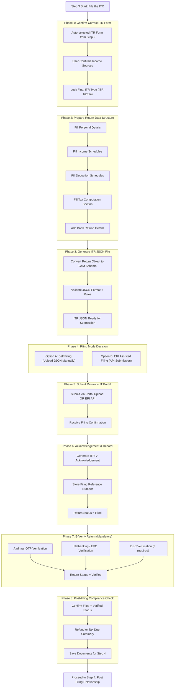

# Details

Perfect. Step 3 is where your SaaS becomes a real “filing platform”, not just a calculator.

Step 1 = collect
Step 2 = compute
Step 3 = submit officially to Income Tax Department

Let’s break Step 3 into clear phases like we did for Step 1 and Step 2.

⸻

Step 3: File the ITR (Multi-Phase Execution Plan)

Think of Step 3 as:

Calculated Return → Government Format → Submission → Verification → Acknowledgement

⸻

Phase 1: ITR Form Selection (Final Confirmation)

Even though Step 2 identifies the form, Step 3 confirms:
	•	ITR-1 → Salary + Interest
	•	ITR-2 → Capital gains
	•	ITR-3 → Business/Freelance
	•	ITR-4 → Presumptive business

Output:
Correct ITR schema locked

⸻

Phase 2: Prefill Return Data Structure

Now build the return in the same format as Income Tax portal expects:
	•	Personal details
	•	Income schedules
	•	Deduction schedules
	•	Tax computation section
	•	Bank refund details

This is your internal “Return Object”.

Output:
Complete return dataset

⸻

Phase 3: Generate Government-Compatible ITR JSON

Income Tax portal accepts:
	•	Online form filling OR
	•	JSON upload

Your SaaS must generate:
	•	Valid ITR JSON file
	•	Schema compliant
	•	All schedules filled correctly

Output:
Ready-to-submit JSON

⸻

Phase 4: Filing Mode Decision (How User Will Submit)

Your SaaS offers 2 paths:

Option A: Self Filing (MVP)
	•	User downloads JSON
	•	Uploads manually on portal

Option B: Assisted Filing (Full SaaS)
	•	Platform files directly via ERI APIs
	•	Requires Protean ERI registration

Output:
Submission path chosen

⸻

Phase 5: Submission to Income Tax Portal

If Self Filing:
	•	Provide step-by-step upload guide

If ERI Filing:
	•	Submit return via API
	•	Track submission status

Output:
ITR Successfully Filed

⸻

Phase 6: Acknowledgement Generation

After submission, user receives:
	•	ITR-V acknowledgement
	•	Filing reference number
	•	Date/time stamp

Your SaaS should store and show:

“Return filed successfully”

Output:
Acknowledgement saved

⸻

Phase 7: E-Verification (Mandatory Step)

Return is incomplete unless verified.

Methods:
	•	Aadhaar OTP
	•	Netbanking login
	•	DSC (for companies)
	•	EVC via bank account

Your SaaS should guide user instantly:

“Verify now (recommended)”

Output:
ITR Verified

⸻

Phase 8: Post-Filing Compliance Checks

Immediately after filing:
	•	Confirm status = “Filed & Verified”
	•	Check if refund expected
	•	Detect if tax payment pending

Output:
Filing completed properly

⸻

Phase 9: Store Filing Record for Step 4 Relationship

Save everything for long-term retention:
	•	Filed JSON
	•	ITR-V PDF
	•	Regime chosen
	•	Refund amount
	•	Next year carry-forward losses (if any)

Output:
User profile ready for next year auto-fill

⸻

Step 3 Final Output

At the end of Step 3, user should have:

✅ Filed return
✅ Verified return
✅ Acknowledgement downloaded
✅ Status tracking enabled

⸻

SaaS Feature Layers (Important)

MVP Filing (Fastest Launch)
	•	Generate JSON
	•	User uploads manually
	•	Verification guide

Full Filing Platform (TaxWala.ai Vision)
	•	ERI API filing
	•	One-click submission
	•	Auto-verification flows
	•	Notice support

⸻

Step 3 Summary Pipeline
	1.	Confirm ITR form
	2.	Build return object
	3.	Generate valid JSON
	4.	Choose filing mode
	5.	Submit return
	6.	Generate acknowledgement
	7.	E-verify
	8.	Compliance check
	9.	Store for future

⸻

If you want, I can now create:
	1.	Mermaid flow diagram for Step 3
	2.	JSON schema architecture
	3.	ERI integration checklist (Protean)
	4.	Exact MVP vs Full Filing roadmap

Just say “draw step 3 mermaid”.

# Flow diagram

