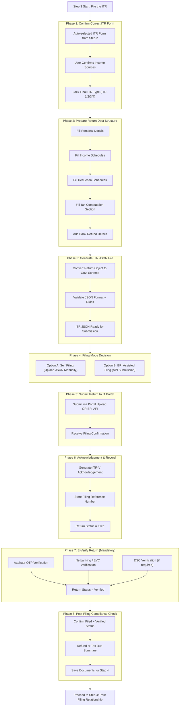

Step 3 is the filing layer. It turns the computed return into a government-acceptable submission with verification and artefact storage.

What this doc covers
- Purpose: build the ITR submission workflow (self-file and ERI API) with mandatory e-verification.
- Audience: backend for schema/ERI integration, frontend for guidance flows, QA for blocking conditions.
- Outcome: filed and verified return with stored acknowledgement and artefacts for Step 4.

Success criteria
- Correct ITR form is locked based on Step 2, with user confirmation of income sources.
- Generated JSON is schema-compliant with the IT portal (all schedules populated).
- User chooses filing mode: self-upload (MVP) or ERI (platform-driven); both are tracked.
- E-verification is enforced; flow cannot end without verification status.
- Filed JSON, ITR-V, reference numbers, and regime choice are stored for future use.

Execution plan
1) Form confirmation: auto-select from Step 2; let user confirm or fix anomalies before locking.
2) Build return object: fill personal details, income/deduction schedules, tax computation, and refund bank details exactly as portal expects.
3) Generate ITR JSON: convert return object to official schema; validate before exposing for download/submit.
4) Choose filing mode:
   - Option A (MVP): user downloads JSON and uploads manually (provide guided steps).
   - Option B (full): ERI API submission via Protean; maintain status callbacks.
5) Submit: upload or API submit; capture filing confirmation response.
6) Acknowledgement: store ITR-V, filing reference number, timestamp; show success state.
7) E-verification: Aadhaar OTP, netbanking/EVC, or DSC; block completion until verified.
8) Post-filing checks: ensure status Filed + Verified; compute refund/payable summary; persist artefacts for Step 4.

Data contract to Step 4
- Filing status, verification status, acknowledgement number/time.
- Stored artefacts: filed JSON, ITR-V PDF, regime chosen, refund amount, carry-forward losses metadata.
- Submission mode (self/ERI) and any pending payment actions.

MVP scope
- Generate JSON, provide manual upload guide, enforce e-verification, store acknowledgement.
- ERI integration can be feature-flagged; add later with the same data contract.

# Flow diagram

