Step 4 is the retention engine. Own the post-filing relationship so users return automatically next year.

What this doc covers
- Purpose: post-filing lifecycle—tracking, notices, storage, renewals, and proactive planning.
- Audience: product for retention design, backend for notices/storage, frontend for dashboard/alerts, QA for status flows.
- Outcome: engaged, retained user with next-year auto-fill ready and ongoing subscription value.

Success criteria
- Filing/refund status is visible and accurate right after Step 3; acknowledgement data is present.
- Notice monitoring and guidance exist; users know what to do next with help/CA escalation.
- Documents are stored securely and reusable next year; uploads are not requested twice.
- Next-year draft is prefilled; renewal prompts fire before filing season.
- Users receive proactive tax nudges (planning and due-date alerts), not just afterthought emails.

Phase plan
1) Status tracking: show Filed/Verified/Processing with ack number, filing date, and current portal status.
2) Refund tracking: expected amount, initiation date, credited status; send notifications on changes.
3) Notice monitoring: poll/ingest IT portal notices; classify (mismatch, defective, scrutiny); offer guidance and CA handoff.
4) Document vault: store Form 16, AIS, proofs, filed JSON, ITR-V; ensure secure access and download.
5) Next-year continuity: carry forward profile, banks, deductions, carry-forward losses; prefill draft when new FY opens.
6) Proactive planning: quarterly insights, advance-tax reminders, income-change alerts with actionable suggestions.
7) Subscription and renewal: plans (Basic/Pro/Premium), renewal nudges ahead of season, upsell notice protection and CA review.
8) Support layer: in-app chat/tickets; CA consultation add-ons; track resolution to drive trust.

Data contract from Step 3
- Filing status, verification status, acknowledgement number/date, refund expectation.
- Artefacts: filed JSON, ITR-V PDF, proofs, carry-forward loss metadata, regime chosen.
- Submission mode (self/ERI) and payment/refund indicators.

MVP scope
- Store ITR-V + JSON, refund tracker, next-year prefill, notice alert email. Add dashboards and CA workflows later.

# Flowdiagram

```mermaid
flowchart TD

    Start["Step 4 Start: Post Filing Relationship"]

    %% Phase 1: Filing Status Tracking
    subgraph P1["Phase 1: Filing Status Dashboard"]
        direction TB
        A1["Show Return Status<br/>Filed / Verified / Processing"]
        A2["Display Ack Number + Filing Date"]
        A3["Track Return Acceptance"]
        A1 --> A2 --> A3
    end

    %% Phase 2: Refund Tracking
    subgraph P2["Phase 2: Refund Tracking & Notifications"]
        direction TB
        B1["Detect Refund Eligibility"]
        B2["Track Refund Initiation Status"]
        B3["Notify User When Credited"]
        B1 --> B2 --> B3
    end

    %% Phase 3: Notice & Compliance Monitoring
    subgraph P3["Phase 3: Notice Monitoring & Support"]
        direction TB
        C1["Monitor IT Portal for Notices"]
        C2["Classify Notice Type<br/>Mismatch / Defective / Scrutiny"]
        C3["Provide Guidance or CA Assistance"]
        C1 --> C2 --> C3
    end

    %% Phase 4: Secure Document Vault
    subgraph P4["Phase 4: Tax Document Vault"]
        direction TB
        D1["Store Form 16, AIS, Proofs"]
        D2["Store Filed JSON + ITR-V PDF"]
        D3["Enable Download Anytime"]
        D1 --> D2 --> D3
    end

    %% Phase 5: Next Year Auto-Fill
    subgraph P5["Phase 5: Next Year Continuity"]
        direction TB
        E1["Carry Forward Profile + Bank Data"]
        E2["Pre-fill Next Year Return Draft"]
        E3["Reduce Next Filing Effort"]
        E1 --> E2 --> E3
    end

    %% Phase 6: Proactive Tax Planning
    subgraph P6["Phase 6: Year-Round Tax Planning"]
        direction TB
        F1["Suggest Tax Saving Opportunities"]
        F2["Advance Tax Due Date Alerts"]
        F3["Income Change Monitoring"]
        F1 --> F2 --> F3
    end

    %% Phase 7: Subscription & Renewal
    subgraph P7["Phase 7: Subscription Retention"]
        direction TB
        G1["Offer Plans<br/>Basic / Pro / Premium"]
        G2["Renewal Reminders Before Filing Season"]
        G3["Upsell Notice Protection + CA Review"]
        G1 --> G2 --> G3
    end

    %% Phase 8: Support & Relationship Layer
    subgraph P8["Phase 8: Ongoing Support"]
        direction TB
        H1["In-App Chat + Ticket Support"]
        H2["CA Consultation Add-on"]
        H3["Customer Trust & Retention"]
        H1 --> H2 --> H3
    end

    %% Main Flow
    Start --> P1 --> P2 --> P3 --> P4 --> P5 --> P6 --> P7 --> P8

    %% Output Loop
    H3 --> End["User Returns Next Year → Step 1 Auto-Filled Journey"]
```

