# Details

Perfect. Step 4 is the real SaaS business.

Most tax platforms stop after filing.

Your SaaS wins if you own Step 4:
	•	retention
	•	subscription
	•	trust
	•	recurring revenue
	•	compliance support

Step 4 is basically:

Post-Filing Relationship + Lifetime Tax Account

Let’s break it down into clear phases.

⸻

Step 4: Post Filing Relationship (Multi-Phase Plan)

Think of Step 4 as:

Filed Return → Tracking → Support → Next Year Auto-Filing → Long-Term Customer

⸻

Phase 1: Filing Status Tracking (Immediately After Filing)

Once ITR is filed + verified, user cares about:
	•	Is it accepted?
	•	Is refund coming?

Your SaaS should show dashboard:
	•	Filed ✔
	•	Verified ✔
	•	Processing ⏳

Data points:
	•	Acknowledgement number
	•	Filing date
	•	Current status

⸻

Phase 2: Refund Tracking & Updates

If refund expected:
	•	Refund amount
	•	Refund initiation date
	•	Bank credit status

Notifications:
	•	“Refund of ₹12,450 initiated”
	•	“Refund credited successfully”

This builds trust.

⸻

Phase 3: Notice & Compliance Monitoring (Biggest Value)

Users fear one thing:

Income Tax Notice.

Your SaaS should provide:
	•	Notice detection
	•	Notice explanation
	•	Response assistance

Examples:
	•	AIS mismatch notice
	•	Defective return notice
	•	Scrutiny notice

This is premium retention feature.

⸻

Phase 4: Document Vault (Lifetime Storage)

Store all user tax documents securely:
	•	Form 16
	•	AIS
	•	Filed JSON
	•	ITR-V PDF
	•	Deduction proofs

Next year benefit:
No re-upload.

This becomes their “Tax Locker”.

⸻

Phase 5: Next Year Auto-Fill & Continuity

When next FY starts:

System pre-fills:
	•	Employer details
	•	Past deductions
	•	Carry-forward losses
	•	Bank accounts

User feels:
“Tax filing becomes 5 minutes next year”

This drives renewal.

⸻

Phase 6: Proactive Tax Planning (Year-Round Engagement)

Instead of once-a-year filing:

Your SaaS gives quarterly insights:
	•	“Invest ₹25k in ELSS to save ₹7k tax”
	•	“Advance tax due date approaching”
	•	“High interest income detected”

This turns filing into ongoing subscription.

⸻

Phase 7: Renewal & Subscription Layer

At the end of filing season:

Offer:
	•	Basic: DIY filing
	•	Pro: CA review
	•	Premium: Notice protection + ERI filing

Renewal triggers:
	•	“Your next filing is due in June”
	•	“Continue plan for auto-filing”

⸻

Phase 8: Support + CA Relationship (Hybrid Model)

Since you have CA partners:

Step 4 includes:
	•	Chat support
	•	CA consultation add-on
	•	Document review service

This is where monetization grows.

⸻

Phase 9: Insights Dashboard (User Tax Health)

Show user:
	•	Total income trend
	•	Tax paid trend
	•	Refund history
	•	Compliance score

Makes platform sticky.

⸻

Phase 10: Re-engagement Loop

Your SaaS should bring user back with:
	•	ITR due date reminders
	•	Investment deadline alerts
	•	Notice monitoring
	•	Auto-filled next year return

End result:
User never leaves.

⸻

Step 4 Summary Pipeline
	1.	Filing status tracking
	2.	Refund tracking
	3.	Notice monitoring & support
	4.	Secure document vault
	5.	Next-year auto-fill
	6.	Year-round tax planning
	7.	Subscription renewal
	8.	CA support layer
	9.	Tax insights dashboard
	10.	Re-engagement loop

⸻

SaaS MVP Step 4 (Start Simple)

For TaxWala.ai MVP, do just:

✅ Store ITR-V + JSON
✅ Refund tracker
✅ Next-year auto-fill
✅ Notice alert email

That alone creates retention.

⸻

If you want, I can now draw the Step 4 Mermaid flow diagram as well.

# Flowdiagram

```mermaid
flowchart TD

    Start["Step 4 Start: Post Filing Relationship"]

    %% Phase 1: Filing Status Tracking
    subgraph P1["Phase 1: Filing Status Dashboard"]
        direction TB
        A1["Show Return Status<br/>Filed / Verified / Processing"]
        A2["Display Ack Number + Filing Date"]
        A3["Track Return Acceptance"]
        A1 --> A2 --> A3
    end

    %% Phase 2: Refund Tracking
    subgraph P2["Phase 2: Refund Tracking & Notifications"]
        direction TB
        B1["Detect Refund Eligibility"]
        B2["Track Refund Initiation Status"]
        B3["Notify User When Credited"]
        B1 --> B2 --> B3
    end

    %% Phase 3: Notice & Compliance Monitoring
    subgraph P3["Phase 3: Notice Monitoring & Support"]
        direction TB
        C1["Monitor IT Portal for Notices"]
        C2["Classify Notice Type<br/>Mismatch / Defective / Scrutiny"]
        C3["Provide Guidance or CA Assistance"]
        C1 --> C2 --> C3
    end

    %% Phase 4: Secure Document Vault
    subgraph P4["Phase 4: Tax Document Vault"]
        direction TB
        D1["Store Form 16, AIS, Proofs"]
        D2["Store Filed JSON + ITR-V PDF"]
        D3["Enable Download Anytime"]
        D1 --> D2 --> D3
    end

    %% Phase 5: Next Year Auto-Fill
    subgraph P5["Phase 5: Next Year Continuity"]
        direction TB
        E1["Carry Forward Profile + Bank Data"]
        E2["Pre-fill Next Year Return Draft"]
        E3["Reduce Next Filing Effort"]
        E1 --> E2 --> E3
    end

    %% Phase 6: Proactive Tax Planning
    subgraph P6["Phase 6: Year-Round Tax Planning"]
        direction TB
        F1["Suggest Tax Saving Opportunities"]
        F2["Advance Tax Due Date Alerts"]
        F3["Income Change Monitoring"]
        F1 --> F2 --> F3
    end

    %% Phase 7: Subscription & Renewal
    subgraph P7["Phase 7: Subscription Retention"]
        direction TB
        G1["Offer Plans<br/>Basic / Pro / Premium"]
        G2["Renewal Reminders Before Filing Season"]
        G3["Upsell Notice Protection + CA Review"]
        G1 --> G2 --> G3
    end

    %% Phase 8: Support & Relationship Layer
    subgraph P8["Phase 8: Ongoing Support"]
        direction TB
        H1["In-App Chat + Ticket Support"]
        H2["CA Consultation Add-on"]
        H3["Customer Trust & Retention"]
        H1 --> H2 --> H3
    end

    %% Main Flow
    Start --> P1 --> P2 --> P3 --> P4 --> P5 --> P6 --> P7 --> P8

    %% Output Loop
    H3 --> End["User Returns Next Year → Step 1 Auto-Filled Journey"]
```

